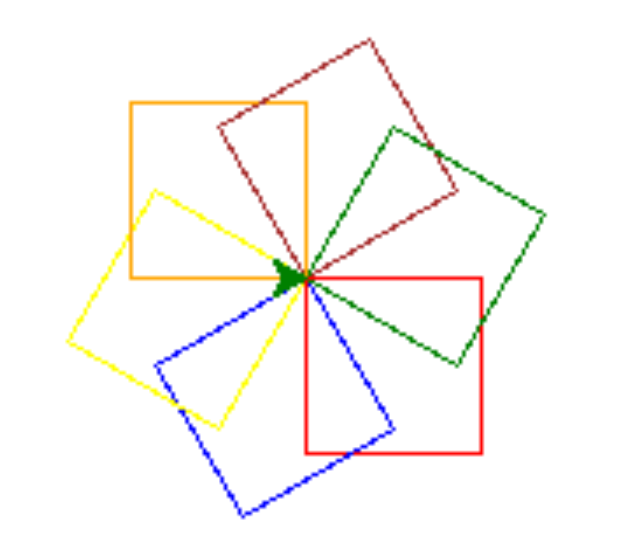
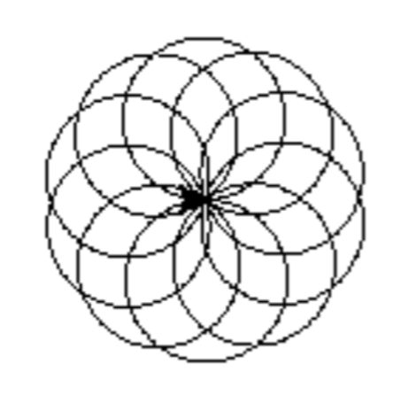

# Aufgaben Turtles
1.	Zeichne mit der Schildkröte (Turtles) ein Quadrat!

2.	Schreibe eine Funktion „quadrat“, die als Inputparameter die Länge des Quadrats hat (also die Anzahl der Schritte der Schildkröte) und das Quadrat zeichnet. Teste deine Funktion!

3.	Lege eine Liste mit 4 verschiedenen Größen an:
laengen = [10, 20, 40, 60]

4.	Schreibe eine Schleife, die durch die Liste auf Aufgabe 3 iteriert und für jede Länge die Funktion aus 2 aufruft.

5.	Erweitere die Funktion aus Aufgabe 2 um den Inputparameter „farbe“. Das Quadrat soll anschließend in der entsprechenden Farbe gezeichnet werden. Teste deine Funktion!

6.	Erstelle mit Hilfe der Funktion aus 5 folgendes Muster:  

7.	Erstelle ein Dictionary mit 6 Farben und 6 Längen. Gehe anschließend mit einer for Schleife durch das Dictionary und zeiche für jedes Paar ein entsprechendes Quadrat.

8.	Schreibe eine Funktion, die mit der Turtle einen Kreis zeichnet.

9.	Erstelle mit Hilfe der Funktion aus 8 folgendes Muster:
 

10.	Erstelle eine Spirale.

11.	Schreibe ein Programm, das einen Stern mit fünf Spitzen zeichnet. Die Spitzen sollen abwechselnd rot und grün sein.

Fortgeschritten
1.	Schreibe eine Funktion, die mit der Turtle einen Stern zeichnet. Die Funktion hat einen Input n, wie viele Zacken der Stern haben soll.
